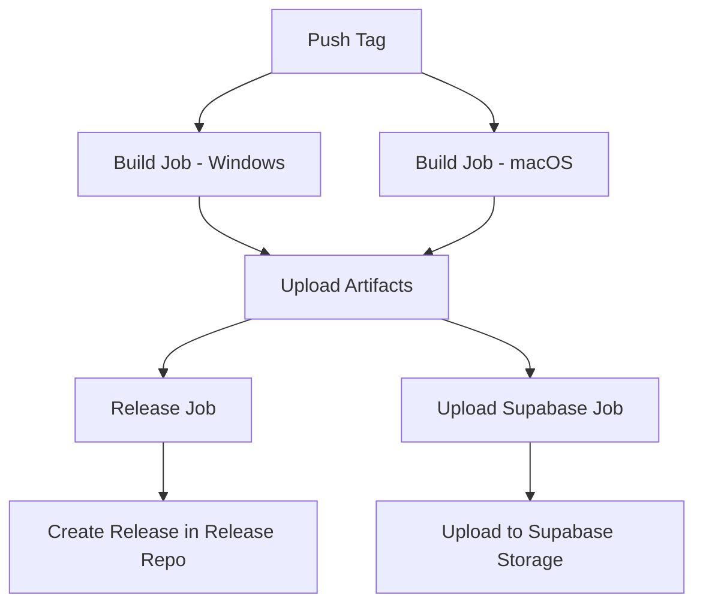

# 跨仓库自动化发布配置指南

## 前置准备

### 1. 创建 Personal Access Token (PAT)

用于从开发仓库访问 Release 仓库。

**步骤:**

1. 访问 GitHub Settings → Developer settings → Personal access tokens → Tokens (classic)
2. 点击 "Generate new token (classic)"
3. 配置 Token:
   - **Note**: `LiteTrans Release Automation`
   - **Expiration**: 建议选择 "No expiration" 或较长期限
   - **Scopes**: 勾选以下权限:
     - ✅ `repo` (完整仓库访问权限)
4. 点击 "Generate token"
5. **立即复制 Token** (只会显示一次!)

### 2. 配置 GitHub Secrets

在**开发仓库**的 Settings → Secrets and variables → Actions 中添加:

| Secret 名称 | 值 | 说明 |
|------------|---|------|
| `RELEASE_REPO_TOKEN` | 刚才创建的 PAT | 用于访问 Release 仓库 |
| `SUPABASE_URL` | 你的 Supabase URL | 从 `.env` 中的 `VITE_SUPABASE_URL` 复制 |
| `SUPABASE_SERVICE_ROLE_KEY` | Service Role Key | 从 `.env` 中复制 |

**添加步骤:**
1. 进入开发仓库 → Settings → Secrets and variables → Actions
2. 点击 "New repository secret"
3. 输入 Name 和 Secret
4. 点击 "Add secret"
5. 重复以上步骤添加所有 3 个 secrets

## 使用方法

### 发布新版本

```bash
# 1. 确保代码已提交
git add .
git commit -m "feat: 新功能"

# 2. 更新版本号 (会自动修改 package.json 并创建 commit)
npm version patch   # 1.0.0 -> 1.0.1
# 或
npm version minor   # 1.0.0 -> 1.1.0
# 或
npm version major   # 1.0.0 -> 2.0.0

# 3. 推送代码和 tag
git push
git push --tags

# 4. 等待 GitHub Actions 自动完成 (约 10-20 分钟)
```

### 发布 Beta 版本

```bash
# 手动创建 beta tag
git tag v1.2.3-beta.1
git push origin v1.2.3-beta.1
```

Beta 版本会自动标记为 "Pre-release"。

### 监控发布进度

1. 访问开发仓库的 Actions 页面
2. 查看 "Release" workflow 的运行状态
3. 点击具体的运行查看详细日志

### 验证发布结果

**检查 Release 仓库:**
1. 访问 `https://github.com/xiaowulang-turbo/LiteTrans-Releases/releases`
2. 确认新版本已创建
3. 验证所有平台的安装包都已上传

**检查 Supabase Storage:**
1. 登录 Supabase Dashboard
2. 进入 Storage → releases bucket
3. 确认 `v{version}/` 目录下有所有文件

## 故障排查

### 工作流失败

**查看日志:**
1. 进入 Actions 页面
2. 点击失败的运行
3. 展开失败的步骤查看错误信息

**常见问题:**

| 错误 | 原因 | 解决方法 |
|------|------|---------|
| `Resource not accessible by integration` | PAT 权限不足 | 检查 `RELEASE_REPO_TOKEN` 是否有 `repo` 权限 |
| `Bad credentials` | Token 无效或过期 | 重新生成 PAT 并更新 Secret |
| `Supabase upload failed` | Supabase 配置错误 | 检查 `SUPABASE_URL` 和 `SUPABASE_SERVICE_ROLE_KEY` |
| `Build failed` | 代码构建错误 | 本地运行 `pnpm run electron:build` 测试 |

### 删除错误的 Release

**删除 tag:**
```bash
# 本地删除
git tag -d v1.2.3

# 远程删除
git push origin :refs/tags/v1.2.3
```

**删除 Release:**
1. 访问 Release 仓库的 Releases 页面
2. 点击要删除的 Release
3. 点击 "Delete" 按钮

## 工作流说明

### 触发条件

推送符合 `v*.*.*` 格式的 tag 时自动触发。

### 执行流程



### 并行执行

- Windows 和 macOS 构建**并行执行**,节省时间
- Release 创建和 Supabase 上传**并行执行**

### 构建产物

**Windows:**
- `LiteTrans-Setup-{version}.exe` - 安装程序
- `latest.yml` - 自动更新配置

**macOS:**
- `LiteTrans-{version}.dmg` - 磁盘镜像
- `latest-mac.yml` - 自动更新配置

## 安全建议

1. **定期轮换 PAT** - 建议每 6-12 个月更新一次
2. **最小权限原则** - PAT 只授予必要的权限
3. **监控 Secret 使用** - 定期检查 Actions 日志,确保没有泄露
4. **备份 Secrets** - 将 Secrets 安全存储在密码管理器中

## 高级配置

### 自定义 Release Notes

修改 [`.github/workflows/release.yml`](file:///d:/Programming/LiteTrans/.github/workflows/release.yml) 中的 `body` 字段:

```javascript
body: `Release v${version}\n\n## 更新内容\n- 新功能 1\n- 修复 Bug 2`
```

### 添加构建通知

在工作流末尾添加通知步骤 (Slack/Discord/Email)。

### 跳过某个平台

临时禁用某个平台的构建:

```yaml
strategy:
  matrix:
    os: [macos-latest]  # 只构建 macOS
```

## 回滚版本

如果发布的版本有问题:

1. **标记为 Pre-release** - 在 Release 页面编辑,勾选 "Set as a pre-release"
2. **删除 Release** - 完全删除该版本
3. **发布修复版本** - 创建新的 patch 版本

## 下一步

- [ ] 配置 GitHub Secrets
- [ ] 测试发布流程
- [ ] 根据需要调整工作流
